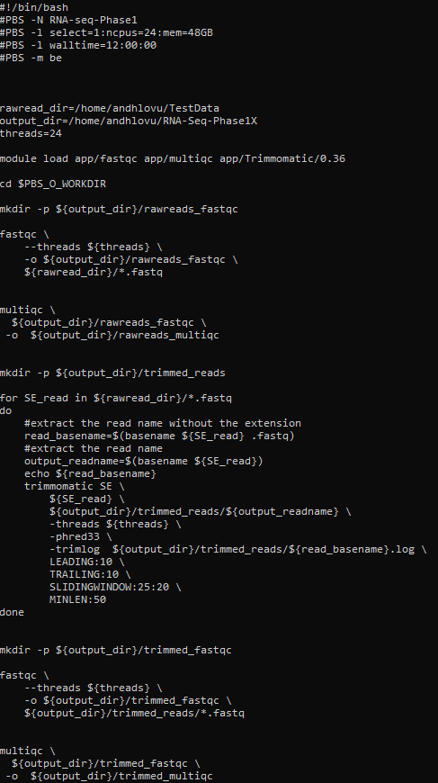

# RNA-Seq workflow development
 Building an RNA-seq workflow for Ion Torrent data 
## Basic introduction to Linux
There are lots of good introductions to Linux online. I recommend this one https://www.bioinf.wits.ac.za/courses/linux/handout.pdf it's purely for sentimental reasons as it was written by my PhD supervisor.

## HPC2 cluster access and commands

- How to log in to the HPC2 cluster https://www0.sun.ac.za/hpc/index.php?title=HOWTO_login

- I have found a great [presentation](https://www.sun.ac.za/english/faculty/science/sci-bioinformatics/Documents/Linux%20and%20HPC.pdf) from the Stellenbosch Center for Bioinformatics and Computational Biology on the HPC2 cluster, very relevant for our purpose.

### Useful commands: Check the HPC2 [HOWTO check up on jobs](https://www0.sun.ac.za/hpc/index.php?title=HOWTO_check_up_on_jobs) for details
<!-- # - quota -s # check disk quota -->
<!-- # - qstat # check the jobs queue -->
<!-- # - qstat -fx <JobID> # check job using JobID details -->
<!-- # - qdel  <JobID> # remove job from queue -->
<!-- # - pstat # overview of cluster usage -->


### Useful cluster related links
- Cluster job submission commands [[LINK]](https://uwaterloo.ca/math-faculty-computing-facility/resources/researchers/computing/sun-grid-engine-sge-batch-queuing-system/basic-sun-grid-engine-sge-job)

## RNA-Seq workflow development
We are essentially going to follow the RNA SOP provided by H3Africa https://h3abionet.github.io/H3ABionet-SOPs/RNA-Seq and we will split it into three phases as described in the workflow.


## PHASE 1

### Checking raw reads quality and trimming of reads

[FASTQC](https://www.bioinformatics.babraham.ac.uk/projects/fastqc/)

```

mkdir rawreads_fastqc
fastqc  --threads 6 -o rawreads_fastqc  TestData/*

```

Here we created the rawreads_fastqc  output directory using the mkdir command and then we run fastqc on the reads in the Testdata directory using 6 threads.


[MULTIQC](https://multiqc.info)

To aggregate the fastqc results into on report we use multiqc. 

```

multiqc  rawreads_fastqc -o  rawreads_multiqc

```
As multiqc will create the output directory, we do not have to create one.

[TRIMMOMATIC](http://www.usadellab.org/cms/?page=trimmomatic)

The trimmomatic tool hase two modes: PE (paired-end) and SE (single-end). We use the SE mode. The tools can only process one pair or one read at a time. This means you have it has to be run n times where n = number of reads.
Therefore, we loop through the files using a ```for``` loop. We create a directory for output files and use the ```basename``` command to extract the filename of the script. We also extract the filename without the extension from the associated filenames using ```basename``` command with the extention after the pathe. For readability we write command line arguments over multiple lines. This is achieved by using a backslash which is an escape character telling bash that the command continues on to the next line.

```

mkdir trimmed_reads
for SE_read in TestData/*.fastq
do
    #extract the read name without the extension
    read_basename=$(basename ${SE_read} .fastq)
    #extract the read name
    output_readname=$(basename ${SE_read})
    echo ${read_basename}
    trimmomatic SE \
	${SE_read} \
	trimmed_reads/${output_readname} \
	-threads 6 \
	-phred33 \
	-trimlog trimmed_reads/${read_basename}.log \
	LEADING:10 \
	TRAILING:10 \
	SLIDINGWINDOW:25:20 \
	MINLEN:50
done

```

After trimming we then run fastqc and multiqc to check the quality of our reads and to check if the trimming was effective.

### PHASE 1 in full



## PHASE 2

### Generating gene/transcript level counts

- The assembled transcriptome is available from NCBI and available on this l[link](https://sra-download.ncbi.nlm.nih.gov/traces/wgs03/wgs_aux/GJ/ZM/GJZM01/GJZM01.1.fsa_nt.gz) under BioProject: [PRJNA835347](https://www.ncbi.nlm.nih.gov/bioproject/PRJNA835347)

- Important to note the extension on this file is .gz indicating that it is a compressed file created using gzip (GNU zip) compression algorithm. Not all tools support this file format so we have to uncompress this file with the following command ``` gunzip <filename.gz>``` 

We can now proceed to map our reads to the reference transcriptome with bowtie.

[BOWTIE 2](https://bowtie-bio.sourceforge.net/bowtie2/manual.shtml)


